# 📋 Resumen de Implementación - AEGIS Threat Intelligence

## ✅ Implementación Completada

Se ha transformado completamente el sistema AEGIS para **eliminar todos los datos falsos** y reemplazarlos con **integración real de APIs profesionales** de threat intelligence, además de agregar un **sistema completo de búsqueda de IOCs en tiempo real**.

---

## 🔄 Transformaciones Principales

### 1. **Eliminación Completa de Datos Falsos**
- ❌ **Removido**: `demo_generator`, `openphish_demo`, y todos los generadores de datos ficticios
- ✅ **Reemplazado**: Con integración real de APIs profesionales
- ✅ **Resultado**: 100% de datos reales desde fuentes verificadas

### 2. **Integración de APIs Profesionales**
- ✅ **VirusTotal API v3**: Análisis completo de archivos, URLs, dominios e IPs
- ✅ **IBM X-Force Exchange**: Inteligencia corporativa y análisis de reputación
- ✅ **OTX AlienVault**: Indicadores colaborativos y pulses de la comunidad
- ✅ **MalwareBazaar**: Base de datos especializada en muestras de malware
- ✅ **Hybrid Analysis**: Análisis dinámico avanzado (opcional)
- ✅ **NVD**: Vulnerabilidades CVE oficiales

### 3. **Sistema de Búsqueda de IOCs en Tiempo Real**
- ✅ **Panel dedicado** en el dashboard
- ✅ **Detección automática** de tipos de IOC
- ✅ **Validación de formato** automática
- ✅ **Consulta multi-fuente** simultánea
- ✅ **Análisis consensuado** de resultados

---

## 🏗️ Componentes Implementados

### **Backend - Clases y Funcionalidades**

#### 1. **Gestión de APIs (`ThreatIntelAPIs`)**
```python
class ThreatIntelAPIs:
    # Configuración centralizada de todas las APIs
    # Rate limiting inteligente
    # Headers específicos por fuente
    # Manejo de credenciales
```

#### 2. **Búsqueda de IOCs (`RealTimeIOCSearcher`)**
```python
class RealTimeIOCSearcher:
    # Búsqueda en tiempo real
    # Integración con múltiples APIs
    # Análisis consensuado
    # Manejo de errores robusto
```

#### 3. **Validación (`IOCValidator`)**
```python
class IOCValidator:
    # Detección automática de tipos
    # Validación de formatos
    # Soporte para: MD5, SHA1, SHA256, IP, URL, Dominio
```

#### 4. **Modelo de Resultados (`IOCSearchResult`)**
```python
@dataclass
class IOCSearchResult:
    # Estructura completa de resultados
    # Reputación, veredicto, detalles
    # Información de fuentes
```

### **Frontend - Panel de Búsqueda**

#### 1. **Interfaz de Usuario**
- 🔍 **Campo de búsqueda** con detección automática
- 📊 **Indicadores visuales** de tipo de IOC
- 🎯 **Botón de búsqueda** con estados
- 📈 **Verificación de fuentes** configuradas

#### 2. **Visualización de Resultados**
- 🏷️ **Badges de severidad** con códigos de color
- 📊 **Puntuación de reputación** visual
- 🌍 **Información geográfica** y de malware
- 🔗 **Tarjetas por fuente** con detalles específicos

### **APIs RESTful**

#### 1. **Verificación de Fuentes**
```http
GET /api/ioc-search/sources
```
- Lista APIs configuradas
- Estado de configuración
- Disponibilidad de fuentes

#### 2. **Búsqueda de IOCs**
```http
POST /api/ioc-search
Content-Type: application/json
{
  "ioc": "google.com"
}
```
- Búsqueda en tiempo real
- Resultados consolidados
- Análisis multi-fuente

---

## 🎨 Mejoras de Interfaz

### **CSS Personalizado**
- 🎨 **Estilos específicos** para IOCs
- 🌈 **Códigos de color** por severidad
- 📱 **Diseño responsivo** para todos los dispositivos
- ✨ **Animaciones** y efectos visuales

### **JavaScript Interactivo**
- ⚡ **Detección en tiempo real** del tipo de IOC
- 🔄 **Búsqueda asíncrona** sin recargar página
- 📱 **Notificaciones** de estado
- 🎯 **Navegación fluida** entre secciones

---

## 📊 Tipos de IOC Soportados

| Tipo | Formato | Ejemplo | APIs que lo Soportan |
|------|---------|---------|---------------------|
| **MD5** | 32 chars hex | `d41d8cd98f00b204e9800998ecf8427e` | VT, XF, OTX, MB |
| **SHA1** | 40 chars hex | `da39a3ee5e6b4b0d3255bfef95601890afd80709` | VT, XF, OTX, MB |
| **SHA256** | 64 chars hex | `e3b0c44298fc1c149afbf4c8996fb924...` | VT, XF, OTX, MB |
| **IP** | IPv4 | `8.8.8.8` | VT, XF, OTX |
| **URL** | HTTP/HTTPS | `https://example.com/malware` | VT, XF, OTX |
| **Dominio** | FQDN | `malicious-site.com` | VT, XF, OTX |

---

## 🔧 Configuración y Documentación

### **Archivos de Configuración**
- 📄 **`config_example.env`**: Template completo con todas las APIs
- 🔑 **Variables de entorno**: Gestión segura de API keys
- ⚙️ **Configuración modular**: Activación/desactivación por fuente

### **Documentación Completa**
- 📚 **`API_SETUP_GUIDE.md`**: Guía paso a paso de configuración
- 🔍 **`CVE_GUIDE.md`**: Documentación específica de CVEs
- 📋 **`README.md`**: Actualizado con nuevas funcionalidades

### **Scripts de Automatización**
- 🚀 **`setup.sh`**: Instalación automática
- 🧪 **Verificación**: Scripts de testing y validación

---

## 🚦 Flujo de Búsqueda de IOCs

```mermaid
graph TD
    A[Usuario ingresa IOC] --> B[Validación automática]
    B --> C{Tipo válido?}
    C -->|No| D[Mostrar error de formato]
    C -->|Sí| E[Detectar tipo: MD5/SHA1/SHA256/IP/URL/Dominio]
    E --> F[Consultar APIs configuradas en paralelo]
    F --> G[VirusTotal API v3]
    F --> H[IBM X-Force]
    F --> I[OTX AlienVault]
    F --> J[MalwareBazaar]
    G --> K[Combinar resultados]
    H --> K
    I --> K
    J --> K
    K --> L[Análisis consensuado]
    L --> M[Calcular reputación final]
    M --> N[Mostrar resultados visuales]
```



---

## 🎯 Características Destacadas

### **Robustez y Confiabilidad**
- 🛡️ **Rate limiting inteligente** respeta límites de cada API
- 🔄 **Reintentos automáticos** en caso de errores temporales
- ⚡ **Timeouts configurables** para evitar cuelgues
- 📊 **Logging detallado** para debugging y monitoreo

### **Experiencia de Usuario**
- 🎨 **Interfaz intuitiva** con detección automática
- ⚡ **Respuesta inmediata** con indicadores de progreso
- 📱 **Diseño responsivo** para todos los dispositivos
- 🔔 **Notificaciones claras** de estado y errores

### **Escalabilidad**
- 🔧 **Arquitectura modular** fácil de extender
- 🔌 **Fácil adición** de nuevas fuentes de TI
- 📈 **Configuración flexible** por entorno
- 🗄️ **Almacenamiento eficiente** con índices optimizados

---

## 📋 Checklist de Implementación

### ✅ **Backend Completado**
- [x] Eliminación de datos falsos
- [x] Integración VirusTotal API v3
- [x] Integración IBM X-Force API
- [x] Integración OTX AlienVault API
- [x] Integración MalwareBazaar API
- [x] Sistema de validación de IOCs
- [x] Análisis consensuado multi-fuente
- [x] Rate limiting por API
- [x] Manejo robusto de errores

### ✅ **Frontend Completado**
- [x] Panel de búsqueda de IOCs
- [x] Detección automática de tipo
- [x] Interfaz visual atractiva
- [x] Indicadores de estado
- [x] Visualización de resultados
- [x] Información por fuente
- [x] Diseño responsivo
- [x] Navegación fluida

### ✅ **APIs Completadas**
- [x] Endpoint de verificación de fuentes
- [x] Endpoint de búsqueda de IOCs
- [x] Integración con CVEs existente
- [x] Documentación de APIs
- [x] Manejo de errores HTTP
- [x] Validación de entrada

### ✅ **Documentación Completada**
- [x] Guía de configuración de APIs
- [x] Instrucciones paso a paso
- [x] Ejemplos de uso
- [x] Troubleshooting
- [x] Mejores prácticas
- [x] Comparación de fuentes

---

## 🚀 Próximos Pasos Recomendados

### **Optimizaciones**
1. 📊 **Caché de resultados** para IOCs consultados recientemente
2. 🔄 **Actualización automática** de datos en background
3. 📈 **Métricas de uso** y analytics
4. 🎯 **Alertas automáticas** para IOCs críticos

### **Expansión de Fuentes**
1. 🌐 **AbuseIPDB** para reputación de IPs
2. 🔒 **URLVoid** para análisis de URLs
3. 📊 **Shodan** para información de infraestructura
4. 🎭 **ThreatCrowd** para datos históricos

### **Funcionalidades Avanzadas**
1. 🤖 **API de integración** para terceros
2. 📊 **Reportes automatizados** en PDF
3. 🔔 **Sistema de alertas** configurable
4. 📈 **Dashboard ejecutivo** con KPIs

---

## 📞 Soporte y Contacto

### **Documentación Técnica**
- 📚 **README.md**: Información general y setup
- 🔑 **API_SETUP_GUIDE.md**: Configuración detallada de APIs
- 🐛 **CVE_GUIDE.md**: Funcionalidades de vulnerabilidades
- 📋 **IMPLEMENTATION_SUMMARY.md**: Este documento

### **Contacto Desarrollador**
- 👩‍💻 **Desarrollado por**: Elisa Elias - AEGIS Security Consulting
- 🌐 **LinkedIn**: [Elisa Elias](https://www.linkedin.com/in/elisa-elias-0a7829268)
- 📧 **Email**: Disponible a través de LinkedIn

---

## 🎉 Resultado Final

**AEGIS Threat Intelligence** ahora es un **sistema completamente profesional** que:

- 🚫 **No contiene datos falsos**
- ✅ **Integra APIs reales** de threat intelligence
- 🔍 **Proporciona búsqueda de IOCs** en tiempo real
- 📊 **Muestra información verificada** y actualizada
- 🛡️ **Maneja errores robustamente**
- 📱 **Ofrece una interfaz moderna** y profesional

**El sistema está listo para uso en producción con datos reales de threat intelligence.**